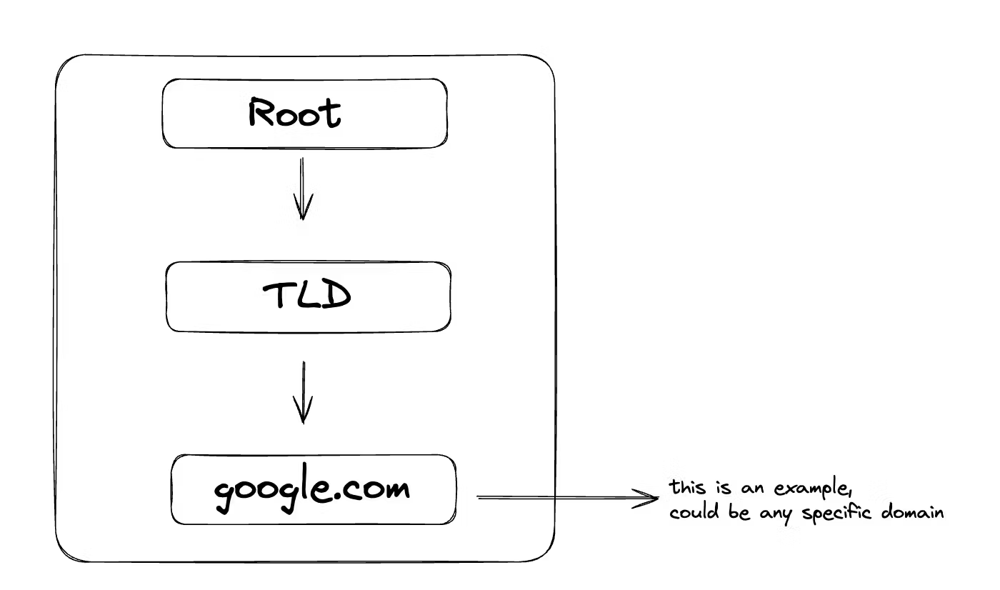

+++
title = "Do I really understand DNS? (Part - 1)"
date = "2024-07-09"
+++

## Resolvers

service on your machine that provide domain name resolution by requesting from a nameserver's to fetch IP address or it's cache.

Different daemon processes on different OS that handle this are

Linux - systemd-resolved, dnsmasq, BIND (named)
to check whats running on your linux machine
```bash
ps aux | grep -e systemd-resolved -e dnsmasq -e named
```


## Nameservers 

Server's that contain DNS records. It returns mapping of DNS name to IP address.
example record -

```bash
google.com.        59    IN    A    142.250.70.46
```

IN - signifies internet, all dns records have this
59 - TTL (time to live). It tells how long a dns query can be cached
A - this is A type of record. A is used for IPv4 addresses

Note - Resolver processes uses /etc/resolv.conf information to proceed with DNS resolution

## Resolver config

This is a file with directives that resolver service follows.
Explained below with couple of examples from linux and MacOS

    personal MacOS or linux system

"/etc/resolv.conf" is configured every time your machine connects to a network.

How it does that is out of scope for this current article, will cover it soon!

    Linux machine in aws

AWS configures these machines, bound to change depending upon region

```bash
domain us-east-2.compute.internal
search us-east-2.compute.internal
nameserver 172.31.0.2
```

## domain & search

Domain names present in these are used to do DNS resolution in private/local network first.

eg - "host" would be first searched as host.us-east-2.compute.internal

```bash
search example.com example.org
```
A query for host1 will first try to resolve host1.example.com and, if that fails, will then try host1.example.org

only difference for domain and search keyword is that search can have multiple domains like in the above example.

## nameserver

```bash
nameserver 172.31.0.2
```

This is the default nameserver used by resolver for DNS resolution. If it doesn't find the domain name in this registry, This nameserver would recursively query further Authoritative Nameserver's. We will see this in action later in the blog

## Nameserver Hierarchy




1. Root Nameservers

    Function: Root nameservers are the highest level in the DNS hierarchy.

    Role: They do not contain actual domain records but redirect your resolver queries to the appropriate top-level domain (TLD) nameservers.

    Example: When you enter a URL, your computer's resolver contacts a root nameserver to find out which TLD nameserver (.com, .org, .net, etc.) to contact.

fun tidbit -

Root nameserver IP's are hardcoded into resolver's code as they very rarely change.
a.root-servers.net IP hasnt's changed in 3 decades

2. Top-Level Domain (TLD) Nameservers. Eg - (.com, .in)

    Function: TLD nameservers handle the next level of queries after the root nameservers.

    Role: They contain information about the second-level domain names within a specific TLD.

    Example: If you’re looking for "example.com", the TLD nameserver for ".com" will provide the nameserver responsible for "example.com".

3. Specific Domain Nameservers. Eg - (example.com)

    Function: These nameservers contain the actual DNS records for specific domain names.

    Role: They provide the final answer in the DNS resolution process, such as the IP address associated with a domain name.

    Example: The authoritative nameserver for "example.com" will provide the IP address for "www.example.com" when queried.


## Complete flow

Try it on your system as well

```bash
dig +trace +additional google.com SOA
```

1. Root Nameservers: The query starts with the root nameservers. There are 13 of these, labeled a through m. For example:

```bash
 .   72070   IN   NS   a.root-servers.net.
```

 (and so on for b through m)

These servers direct the query to the appropriate Top-Level Domain (TLD) servers.

2. .com TLD Nameservers: The root servers provide information about the .com TLD servers. For example:

```bash
 com.   172800   IN   NS   a.gtld-servers.net.
 a.gtld-servers.net.   172800   IN   A   192.5.6.30
 a.gtld-servers.net.   172800   IN   AAAA   2001:503:a83e::2:30
```
 (and similar entries for b through m)

These servers are responsible for the .com domain and will direct the query to Google's nameservers.

3. Google's Authoritative Nameservers: The .com TLD servers provide information about Google's nameservers:

```bash
 google.com.   172800   IN   NS   ns1.google.com.
 ns1.google.com.   172800   IN   A   216.239.32.10
 ns1.google.com.   172800   IN   AAAA   2001:4860:4802:32::a
```

4. Final Answer: One of Google's nameservers (in this case, ns1.google.com) provides the requested SOA record:

```bash
 google.com.   60   IN   SOA   ns1.google.com. dns-admin.google.com. 648302543 900 900 1800 60
```

The flow goes like this:

    Your local resolver starts at the root servers.

    A root server directs it to the .com TLD servers.

    A .com TLD server directs it to Google's nameservers.

    One of Google's nameservers provides the final IP address


## Glue Records

In the above command "+additional" shows some pretty interesting details.

If the root nameserver just returned another nameserver, We would be stuck in a circular loop.

whats the IP for b.gtld-servers.net. ?

    ask b.gtld-servers.net.

glue records provides IP of nameserver as well that can be used

```bash
com.            172800    IN    NS    b.gtld-servers.net.

b.gtld-servers.net.    172800    IN    A    192.33.14.30
```

So, this was still the very basic principles, will be covering more practical debugging things soon!